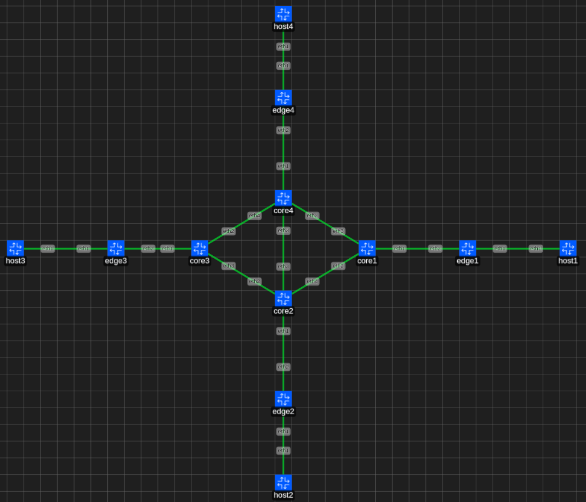

# Laboratório PORVIR

## Topologia




### Subindo a topologia PORVIR

> [!NOTE]  
> Os comandos abaixo são executados dentro deste diretório

Subindo a topologia

```bash
$ containerlab deploy -t porvir.clab.yml
```

Configurando os hosts:
```bash
$ sudo ./p4_programs/porvir/config_hosts.sh
```
> [!NOTE]  
> Se o seu usuário não tiver permissão para executar o docker, use o sudo.

Configurando os swiches:

```bash
$ ./p4_programs/porvir/config_edges.sh

```

### Endereço de admin de cada nó

É possível acessar via os nós via SSH pelo endereço de administração. A rede é 172.20.20.0/24 e para facilitar a identificação de cada nó pelo IP, a atribuição está organizada da seguinte forma no ultimo octeto:

- 2-9 - identificação dos hosts
- 10-19 - identificação dos edges
- 20-29 - identificação dos cores

| Nó | Endereço IP |
| -- | ----------- |
| host1 | 172.20.20.2 |
| host2 | 172.20.20.3 |
| host3 | 172.20.20.4 |
| host4 | 172.20.20.5 |
| edge1 | 172.20.20.12 |
| edge2 | 172.20.20.13 |
| edge3 | 172.20.20.14 |
| edge4 | 172.20.20.15 |
| core1 | 172.20.20.22 |
| core2 | 172.20.20.23 |
| core3 | 172.20.20.24 |
| core4 | 172.20.20.25 |
